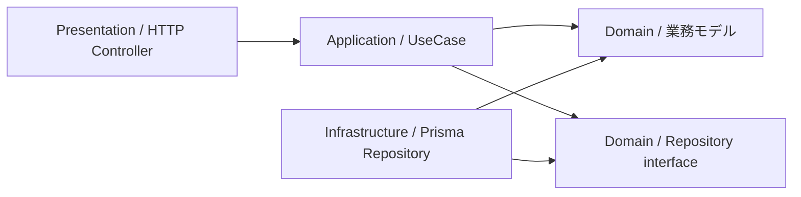

# バックエンド構成

## フロントエンド構成

Next.js App Router を使い、画面固有のコードと複数画面で使う UI を分ける。

```text
src/
├── app/                         # route、page、layout
│   └── projects/
│       └── page.tsx
├── components/
│   ├── ui/                      # shadcn/ui を土台にした汎用 UI
│   └── common/                  # StatusBadge など複数画面で使う部品
├── features/                    # projects、tasks など業務機能ごとの UI・API 呼び出し
└── lib/                         # API client、認証、共通関数
```

- `components/ui` は shadcn/ui の部品を配置・調整する場所にする。
- `components/common` には、アプリ固有だが複数画面で使う小さな UI を置く。
- `features` には、プロジェクト作成フォームやタスク一覧など業務機能ごとのコードを置く。
- 画面専用の小さな部品は、その route 配下の `_components` に置いてよい。
- UI 部品は必要に応じて Storybook の story を追加し、画面を開かなくても状態を確認できるようにする。

### Web の認証基盤

Supabase Auth のセッションは `@supabase/ssr` を使って Cookie に保存する。
`src/lib/supabase/client.ts` はブラウザ用、`server.ts` はリクエストごとの Cookie を参照するサーバー用クライアントを作る。
共有する接続設定は公開用の URL と Publishable key に限り、`apps/web/.env.local` に設定する。

Next.js の `src/proxy.ts` は認証・Project の画面表示前に `src/lib/supabase/proxy.ts` を呼ぶ。
Server Component は Cookie を書けないため、Proxy で SDK の `getClaims()` による確認・更新を行い、
更新した Cookie を後続の画面処理とブラウザの両方へ渡す。SDK が返すキャッシュ制御ヘッダーも維持する。

ログイン画面は `(auth)/login` に置き、Server Component のページと Client Component のフォームに分ける。
ログイン後は `/api/auth/me` の本人取得を待ってプロジェクト一覧へ移動する。
Project の一覧・詳細はサーバー用クライアント、それ以外の作成・更新・アーカイブ・解除はブラウザ用クライアントでセッションを取得し、全 6 API に Bearer token を付ける。
登録・メール確認、未ログイン時の導線とログアウトは後続の段階で実装する。
NestJS API でも token を検証し、membership・role による認可は既存の実装順に沿って追加する。

## テスト構成

| 対象                      | 主な道具                       | 例                                               |
| ------------------------- | ------------------------------ | ------------------------------------------------ |
| UI コンポーネント         | Vitest + React Testing Library | フォームの入力エラー、ボタン押下、空状態         |
| UI の見た目・状態カタログ | Storybook                      | StatusBadge の各 status、Button の disabled 状態 |
| NestJS API                | Vitest + Supertest             | `POST /projects` の成功、400、403、404           |
| ブラウザ全体の導線        | Playwright                     | ログイン → プロジェクト作成 → タスク作成         |

Storybook は自動テストの代わりではない。UI を目で確認・共有するカタログとして使い、操作や仕様の確認は Vitest / Playwright で行う。

## 採用する構成

現在は NestJS の Module を機能ごとに分け、その機能内でレイヤード構成にする。業務ルールを理解・実装した後、一部の操作に DDD のモデルを導入し、その操作の依存関係をクリーンアーキテクチャに沿って整理する。

現在の処理の流れ:

```text
HTTP request
  -> Controller
  -> Service
  -> Repository
  -> PrismaService
  -> PostgreSQL
```

```text
src/
└── modules/
    ├── health/
    ├── prisma/
    │   ├── prisma.module.ts
    │   └── prisma.service.ts
    ├── auth/
    │   ├── auth.controller.ts
    │   ├── auth.service.ts
    │   ├── auth.repository.ts
    │   └── auth.module.ts
    └── projects/
        ├── dto/
        │   ├── create-project.dto.ts
        │   ├── update-project.dto.ts
        │   └── project-response.dto.ts
        ├── projects.controller.ts
        ├── projects.service.ts
        ├── projects.repository.ts
        └── projects.module.ts
```

上記は現在の主な構成である。`tasks` は Task CRUD の実装時に追加する。DDD やクリーンアーキテクチャへの移行は、対象操作を決めてから行う。

## それぞれの責務

| 層            | 役割                                                           | 例                                     |
| ------------- | -------------------------------------------------------------- | -------------------------------------- |
| Controller    | HTTP の受付と応答を担当する。入力 DTO を受け、Service を呼ぶ。 | `POST /projects` を受ける              |
| Service       | 機能の処理の流れと業務ルールを担当する。                       | プロジェクト名を確認して保存を依頼する |
| Repository    | DB 操作をまとめる。Prisma の query をここに置く。              | `findById()`、`create()`               |
| PrismaService | Prisma Client を NestJS から使うための共通窓口。               | `prisma.project.findMany()`            |
| DTO           | API で受け取る入力の形とバリデーションを定義する。             | `name` は必須文字列                    |

## Repository を採用する理由

Repository は「Service が DB の細かな書き方を知らずに、データを取得・保存するための窓口」である。

```ts
// Service: 何をしたいかを書く
return this.projectsRepository.findById(id);

// Repository: Prisma を使って、どう取得するかを書く
return this.prisma.project.findUnique({ where: { id } });
```

Repository を通じて Service とデータアクセスの責務を分離する。現在の段階では、`projects.repository.ts` の1ファイルで実装する。

クリーンアーキテクチャへ移行する操作では、内側に Repository interface を定義し、外側に Prisma を使う実装を置く。UseCase が必要な保存・取得の操作を interface として表し、具体的な DB 実装から独立させることを学ぶ。

## 守るルール

- Controller に Prisma の query や複雑な業務判断を書かない。
- Service に HTTP の `Request` / `Response` を渡さない。
- Repository は HTTP の知識を持たない。
- DTO は API 入力用であり、DB の型をそのまま公開するものではない。
- 現段階では、複数の機能にまたがる処理もまず Service で読みやすく書く。関連する業務ルールを理解した後、対象操作のドメインモデルや UseCase へ整理する。
- UseCase や Repository interface は、依存関係を整理する段階に進んだ操作に導入する。導入する層の役割と、移動する処理を説明する。
- 認証済みユーザー・Project membership・role は API 側で確認する。構成を移しても、同じ認証・認可ルールを適用する。

## DDD・クリーンアーキテクチャの導入方針

2026-10-03 に、学習しながら「ルールを理解する → モデルにする → 依存を整理する」と進める方針を決めた。DDD は業務の用語・ルールをモデルへ表現する考え方、クリーンアーキテクチャは業務モデルと UseCase を中心に依存関係を整理する構成として取り入れる。

会社のテンプレートについて共有された調査結果では、設計方針として「DDD＋クリーンアーキテクチャ」を採用している。このプロジェクトも、会社の構成と対応付けて学ぶためにその名称と層の分け方に揃える。オニオンアーキテクチャとも、業務ルールを中心に置き、依存を内側へ向ける原則を共有する。

### 段階1: 現在の構成で業務ルールを実装する

- 用語とルールは [DOMAIN_MODEL.md](./DOMAIN_MODEL.md) に揃える。Project、owner、member、viewer の意味を文書・コード・テストで統一する。
- 現在の Controller / Service / Repository で、処理順、認証・認可、DB 保存、transaction を実装・確認する。
- 次の対象は、Project 作成時の owner 登録と、既存 Project API の認証保護である。Project と owner membership は同じ transaction で保存する。
- 現在の実装はこの段階にある。Project 権限・ログイン画面などの機能の実装順は、既存の要件とフォローアップタスクに従う。

### 段階2: 一部の操作にドメインモデルを導入する

- 実装済みの操作を1つ選び、関連する業務ルールを Entity や Value Object にまとめる。Entity は ID で同一性を持つ対象、Value Object は値とその制約を表す対象として使う。
- 例として、ProjectName に名前の正規化・文字数制約をまとめる。メンバー管理を実装した後は、owner 自身の削除・role変更を禁止するルールのモデル化も検討する。
- Service はモデルを使って処理を進め、データの取得・保存を Repository に依頼する。モデル化したルールの判断はドメインモデルにまとめる。
- ドメインモデルは NestJS、Prisma、Supabase SDK、HTTP DTO に依存させない。Prisma のモデルとのデータ変換は必要な箇所に用意する。
- 集約やモデルの境界は、用語の意味と、一緒に守るべき整合性の範囲をもとに必要な時点で設計する。

### 段階3: 同じ操作の依存関係を整理する

移行対象の操作は、機能単位の Module 内で次の責務に分ける。以下は今後の構成方針であり、現在の実装は段階1の構成である。

| 層               | 担当                                                     |
| ---------------- | -------------------------------------------------------- |
| `domain`         | Entity、Value Object、業務ルール、Repository interface   |
| `application`    | UseCase によるデータ取得・モデルの操作・保存の組み立て   |
| `infrastructure` | Prisma Repository、Supabase SDK を使う外部サービスの実装 |
| `presentation`   | REST Controller、HTTP DTO、HTTP 応答・エラーの変換       |

- 対象操作を UseCase にまとめ、データ取得・ドメインモデルの操作・保存の処理順を担当させる。
- Repository interface は Domain 側に、Prisma を使う実装は Infrastructure 側に置く。外部サービスの窓口は利用する内側の層で定義し、Supabase SDK を使う実装を外側に置く。
- Domain / Application は NestJS、Prisma、外部 SDK、HTTP DTO の型を参照しない。HTTP 入出力や外部固有のデータは境界で変換する。
- NestJS の Module で UseCase と外側の実装を結び付ける。業務上の失敗を HTTP status に変換する処理は Controller や例外 filter など HTTP 側に置く。

移行した操作のコードの依存方向は、次のように内側へ向ける。矢印はコードの参照方向を表す。



### 変更の進め方と確認

- 1つの操作で段階1から3へ進める。対象操作ごとに、導入する層・守る業務ルール・確認方法を先に説明する。
- 機能追加と構成の移行は、差分を確認しやすい PR に分ける。移行中は、対象操作を担当する Service または UseCase を明確にする。
- API の契約、認証・認可、DB への保存と transaction の整合性は移行前後で保持する。Prisma 固有の transaction 型は外側の実装で扱う。
- ドメインモデルのルールは Vitest の単体テストで確認し、HTTP と DB・認証をまたぐ動作は既存の API E2E で確認する。変更した TypeScript の lint・typecheck も実行する。
- 変換用の Mapper や汎用 BaseRepository は、具体的な必要性を確認して導入する。

### 参考

- [DDD Reference（Eric Evans）](https://www.domainlanguage.com/ddd/reference/)
- [The Clean Architecture（Robert C. Martin）](https://blog.cleancoder.com/uncle-bob/2012/08/13/the-clean-architecture.html)
- [The Onion Architecture: part 1（Jeffrey Palermo）](https://jeffreypalermo.com/2008/07/the-onion-architecture-part-1/)
