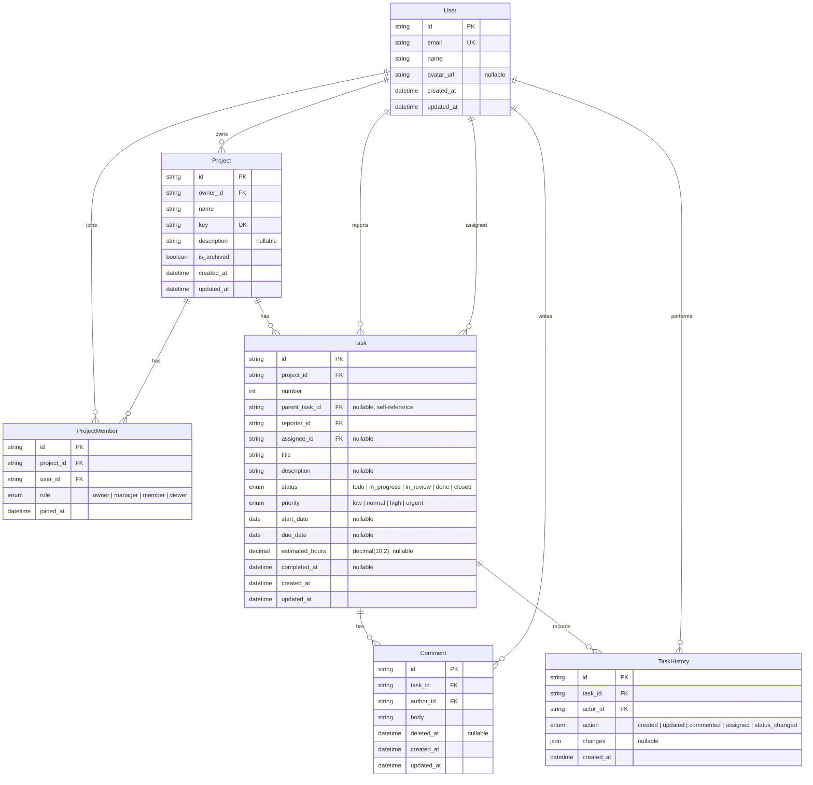

# Entity Relationship Diagram

この図は完成時のデータモデル案である。カラム定義とビジネスルールは、実装を進めながら本書と要件資料へ段階的に追記する。

## 補足制約

- `Task.parent_task_id` は `Task.id` を参照する自己参照FKである
- Mermaid上では可読性を優先し、TaskからTaskへの自己参照線を省略している
- `ProjectMember` は `(project_id, user_id)` の組み合わせで一意とする
- `Task` は `(project_id, number)` の組み合わせで一意とする
