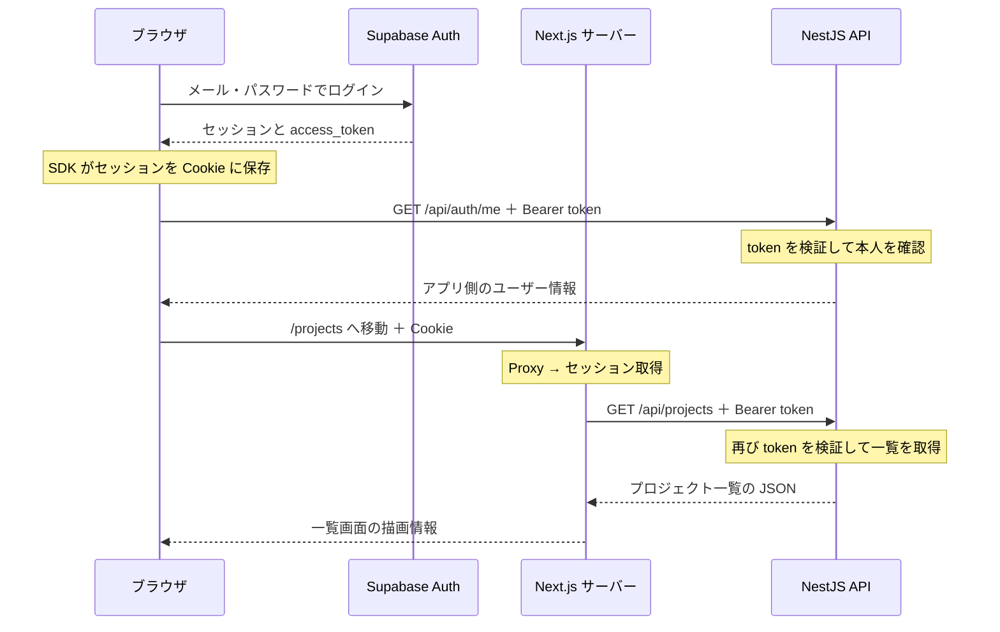

# ログインからプロジェクト一覧表示までの流れ

2026-10-06 時点の実装をもとにした学習メモ。
ログインはブラウザで行い、プロジェクト一覧の取得は Next.js サーバーで行う。
登録・メール確認後に自動ログインする流れは [登録・メール確認の学習メモ](./WEB_AUTH_REGISTRATION_FLOW.md) を参照する。

## 全体の図



## コードに沿った処理順

1. **ブラウザで Supabase にログインする**

   [login-form.tsx](<../apps/web/src/app/(auth)/login/_components/login-form.tsx>) の
   `signInWithPassword(values)` がメール・パスワードを Supabase Auth に送る。
   成功するとセッションが返り、ブラウザ用 SDK が Cookie に保存する。
   このクライアントは [lib/supabase/client.ts](../apps/web/src/lib/supabase/client.ts) の
   `createBrowserClient()` で作っている。

2. **ブラウザから NestJS で本人を確認する**

   `data.session.access_token` を取り出し、
   [get-current-user.ts](<../apps/web/src/app/(auth)/login/_lib/get-current-user.ts>) の
   `getCurrentUser(accessToken)` を呼ぶ。
   この関数が Bearer ヘッダーを付けて `GET /api/auth/me` にアクセスする。

   NestJS の [AuthGuard](../apps/api/src/modules/auth/auth.guard.ts) は
   [AuthService](../apps/api/src/modules/auth/auth.service.ts) を通して Supabase Auth に token を検証してもらい、
   メールアドレスが確認済みであることを確認する。
   アプリ側の User を取得し、未登録なら初回作成して、ユーザー情報を返す。

   フォーム側では `await getCurrentUser(accessToken)` で成功を待つ。
   失敗すると `catch` でエラーを表示し、画面遷移を止める。
   現在は取得成功を確認する目的なので、返り値を変数に保存せず `await` している。

3. **プロジェクト一覧へ移動する**

   `router.replace('/projects')` で、現在のログイン画面の履歴を置き換えて移動する。
   `router.refresh()` で、サーバー側の画面情報を取得し直す。
   ブラウザから Next.js へのリクエストには、保存された Cookie が送られる。

4. **画面処理の前に Proxy が動く**

   `/projects` は `matcher` の対象なので、Next.js にリクエストが届くと、
   特殊ファイルの [src/proxy.ts](../apps/web/src/proxy.ts) が先に実行される。
   そこから [lib/supabase/proxy.ts](../apps/web/src/lib/supabase/proxy.ts) の `updateSession()` を呼ぶ。

   `getClaims()` で token を確認し、必要ならセッションを更新する。
   更新した Cookie は、後続の Server Component が読むリクエストと、
   ブラウザへ返すレスポンスの両方に反映する。
   その後、`page.tsx`・`layout.tsx` の処理に進む。

5. **Next.js サーバーが一覧 API を呼ぶ**

   [get-projects.ts](<../apps/web/src/app/(app)/projects/_lib/get-projects.ts>) は、
   [lib/supabase/server.ts](../apps/web/src/lib/supabase/server.ts) の `createClient()` を呼ぶ。
   この関数は Next.js の `cookies()` を使ってリクエストの Cookie を参照し、
   SDK の `createServerClient()` でサーバー用クライアントを作る。

   `getSession()` でセッションを取得し、`data.session.access_token` を取り出す。
   その token を Bearer ヘッダーに付けて、NestJS の `GET /api/projects` を呼ぶ。

   ```tsx
   const accessToken = data.session.access_token;

   const response = await fetch(`${apiBaseUrl}/projects`, {
     headers: {
       Authorization: `Bearer ${accessToken}`,
     },
     cache: 'no-store',
   });
   ```

   `getSession()` の用途はセッションと token の取得である。
   API の本人確認は、リクエストで受け取った token を NestJS が検証して行う。
   `NEXT_PUBLIC_API_BASE_URL` は通常 `http://localhost:3001/api` なので、
   `fetch()` では `/projects` を追加すると `/api/projects` になる。

6. **NestJS が認証し、一覧を返す**

   `/api/auth/me` が成功した後でも、Project API のリクエストには token が必要である。
   `AuthGuard` は、このリクエストの token も検証する。
   成功すると、次の流れで PostgreSQL のプロジェクトを取得する。

   ```text
   ProjectsController → ProjectsService → ProjectsRepository → PrismaService → PostgreSQL
   ```

   NestJS は、取得したプロジェクト一覧を JSON で Next.js サーバーに返す。

7. **取得したデータを画面に表示する**

   一覧の [page.tsx](<../apps/web/src/app/(app)/projects/(list)/page.tsx>) は Server Component であり、
   `await getProjects()` で受け取ったプロジェクトを `ProjectsTable` に渡す。
   Next.js が画面の描画情報をブラウザに返し、一覧が表示される。

   [layout.tsx](<../apps/web/src/app/(app)/layout.tsx>) 内のサイドバー用処理も、
   同じ `getProjects()` を使い、取得したデータを `ProjectsSidebar` に渡している。

## 通信ごとに渡す認証情報

| 通信                                 | 渡す情報                               |
| ------------------------------------ | -------------------------------------- |
| ブラウザ → Supabase Auth（ログイン） | メールアドレス・パスワード             |
| ブラウザ → NestJS（本人取得）        | `Authorization: Bearer <access_token>` |
| ブラウザ → Next.js（画面取得）       | Cookie                                 |
| Next.js → NestJS（一覧取得）         | `Authorization: Bearer <access_token>` |

ブラウザ → Next.js の Cookie により、サーバー側でも同じログインセッションを参照できる。
NestJS API に送る際は、そのセッションの access token を取り出して Bearer ヘッダーに付ける。

このメモの対象は、ログイン・本人取得・プロジェクト一覧取得である。
membership・role による認可は後続 PR で扱う。
後続作業は [QUALITY_SECURITY_FOLLOW_UP_TASKS.md のタスク5](./QUALITY_SECURITY_FOLLOW_UP_TASKS.md#5-supabase-auth-と-project-権限を実装する) を参照する。

## 図の表示方法

図は Markdown 内の `mermaid` コードブロックとして保存しているため、テキストで編集できる。
GitHub の Markdown 表示や Mermaid 対応のプレビューでは、図として表示できる。
対応していないビューアーでも、図の元になるコードは残る。
GitHub での表示方法は [GitHub 公式ドキュメント](https://docs.github.com/en/get-started/writing-on-github/working-with-advanced-formatting/creating-diagrams) を参照する。
