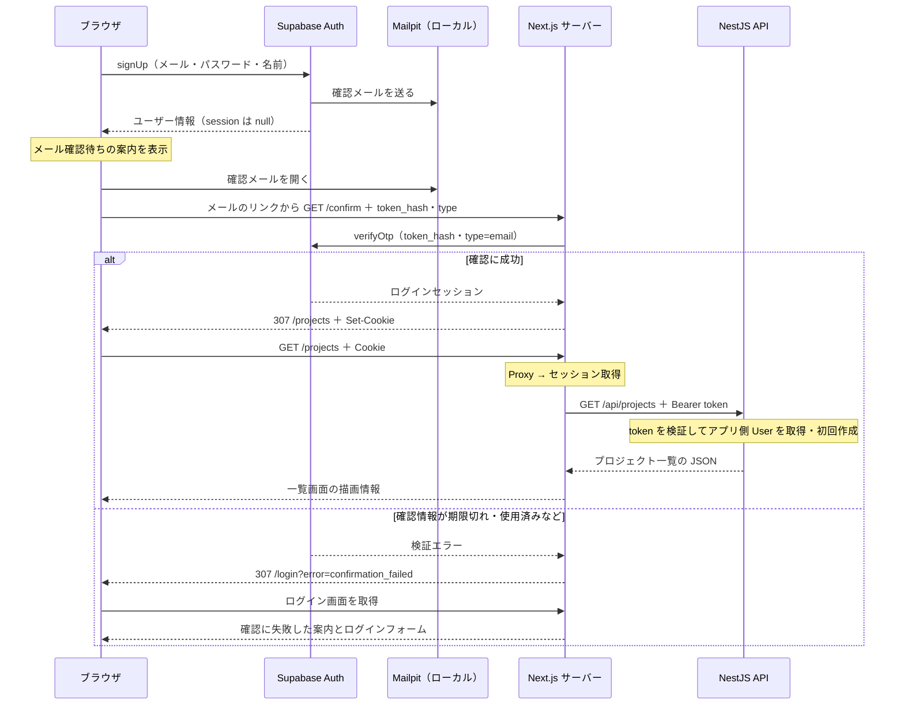

# 登録・メール確認から自動ログインまでの流れ

2026-10-08 時点の実装をもとにした学習メモ。
確認メールのリンクを開いたら、メールアドレスを確認し、ログイン済みの状態でプロジェクト一覧へ進む。
メール・パスワードでログインする場合は [ログインの学習メモ](./WEB_AUTH_LOGIN_FLOW.md) を参照する。

## 全体の図



## コードに沿った処理順

1. **登録フォームで入力を検証する**

   [register-form.tsx](<../apps/web/src/app/(auth)/register/_components/register-form.tsx>) は、
   Zod と React Hook Form で名前・メールアドレス・パスワード・確認用パスワードを検証する。
   名前とメールアドレスは trim する。パスワードは trim せず、8文字以上と確認用との一致を確かめる。
   送信中は入力とボタンを無効にし、認証・通信エラーはフォーム上部に表示する。

2. **Supabase Auth に登録する**

   ブラウザ用クライアントの `signUp()` にメールアドレス・パスワードを送り、
   名前は `options.data.name` として渡す。名前は Supabase Auth の `user_metadata.name` に保存される。
   確認用パスワードは送信しない。

   メール確認が必要な設定では、登録時の `data.session` は `null` になる。
   フォームには、確認メールのリンクを開くと自動的にアプリへ進む案内を表示する。
   アプリ側 User の `name` への反映は後続作業である。

3. **確認メールのリンクを開く**

   [confirmation.html](../supabase/templates/confirmation.html) のリンクには、
   Supabase が `SiteURL` と `TokenHash` を埋め込む。

   ```text
   http://localhost:3000/confirm?token_hash=確認用の値&type=email
   ```

   `(auth)` は URL に含まれない Route Group なので、
   [(auth)/confirm/route.ts](<../apps/web/src/app/(auth)/confirm/route.ts>) の URL は `/confirm` になる。
   リンクを開くと、そのファイルの `GET(request)` が実行される。
   `request.nextUrl.searchParams` から `token_hash` と `type` を取り出す。

4. **Next.js サーバーで確認情報を検証する**

   確認情報がない場合や `type` が `email` 以外の場合は、Supabase を呼ばず `400` の JSON を返す。
   有効な入力は [lib/supabase/server.ts](../apps/web/src/lib/supabase/server.ts) のクライアントで
   `verifyOtp({ token_hash: tokenHash, type })` に渡す。
   有効期限や使用済みかどうかの検証は Supabase Auth が行う。

5. **セッションを保存し、アプリへ移動する**

   `verifyOtp()` が成功するとログインセッションが発行される。
   Route Handler は Cookie を書けるため、サーバー用 SDK の `setAll()` を通して保存する。
   `/projects` へリダイレクトすると、ブラウザは保存した Cookie を次の画面リクエストに送る。

   一覧取得の `getSession()` が access token を取り出し、NestJS の Project API に Bearer ヘッダーで渡す。
   この流れはログインフォームを通らないため、フォーム内の `/api/auth/me` は呼ばない。
   Project API の AuthGuard が本人を確認し、アプリ側 User を取得または初回作成する。

6. **検証エラーの場合は案内を表示する**

   Supabase の検証エラーでは `/login?error=confirmation_failed` に移動する。
   [ログインの page.tsx](<../apps/web/src/app/(auth)/login/page.tsx>) は
   `await searchParams` で目印を受け取り、一致する場合だけ固定の案内を表示する。
   URL の値を認証済みの証拠として扱うことはなく、利用者の文字列をそのまま表示することもない。

## 確認用の値と保護する範囲

`token_hash` は API 用の `access_token` とは別の、メール確認用の値である。
この値で検証とセッション取得ができるため、ハッシュ化されていても秘密として扱う。
有効期限はローカル設定の `otp_expiry = 3600`（1時間）で、確認リンクは一度使うと再利用できない。

検証後のリダイレクトでは、新しい移動先 URL を作るため、`token_hash` や `type`、
利用者が付けた `next`・`redirect_to` を引き継がない。
応答には `Cache-Control: private, no-store` と `Referrer-Policy: no-referrer` を付ける。
アプリの確認処理では token の値をログに出さない。
リダイレクトは、既に記録されたアクセスログやブラウザ履歴を消す処理ではない。
本番の HTTPS と、ログ収集側でのクエリ除外・マスキングは外部公開前に確認する。

## ローカル Supabase の設定

[config.toml](../supabase/config.toml) で、次の設定を使う。

```toml
[auth.email]
enable_confirmations = true

[auth.email.template.confirmation]
subject = "メールアドレスの確認"
content_path = "./supabase/templates/confirmation.html"
```

テンプレートの HTML を置くだけでは読み込まれない。`content_path` で指定してから、
リポジトリのルートでローカル Supabase を再起動する。

```bash
pnpm exec supabase stop
pnpm exec supabase start
```

確認メールは [Mailpit](http://localhost:54324) で受信するため、実在するメールアドレスは不要である。
[Supabase Studio](http://localhost:54323) の Authentication / Users で確認済み状態を見られる。
設定変更は新しく送るメールから反映される。クラウドでは Dashboard のメールテンプレートと URL 設定を別途反映する。

## 確認結果と後続作業

- ユーザーによる手動確認で、新規登録、Mailpit の受信、確認後の一覧表示、再読み込み後のログイン状態維持を確認した。
- ログイン画面の確認失敗メッセージも、目印付きの URL で手動確認した。
- 登録フォーム13件と確認 Route Handler 10件のテストを追加し、Web 全体の129件、lint、typecheck、build（`--webpack`）が通過した。
- SDK をモックする単体テストでは、Cookie が実際のブラウザへ保存されることまでは検証しない。ブラウザ全体の自動テストは Playwright 導入時に追加する。
- 未ログイン時の移動、ログアウト、名前の同期とサイドバー表示、membership・role の認可は後続作業である。

実装順は [フォローアップタスク5](./QUALITY_SECURITY_FOLLOW_UP_TASKS.md#5-supabase-auth-と-project-権限を実装する) を参照する。
SDK とテンプレートの詳細は [Supabase の Next.js 実装例](https://supabase.com/docs/guides/getting-started/tutorials/with-nextjs#creating-a-confirmation-endpoint) と
[ローカルのメールテンプレート設定](https://supabase.com/docs/guides/local-development/customizing-email-templates) を参照する。
